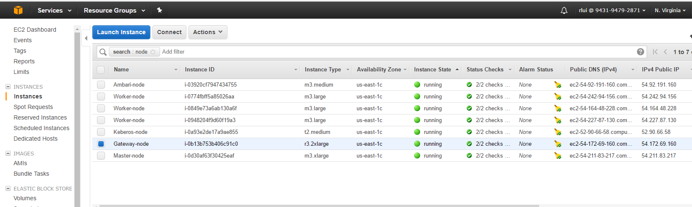
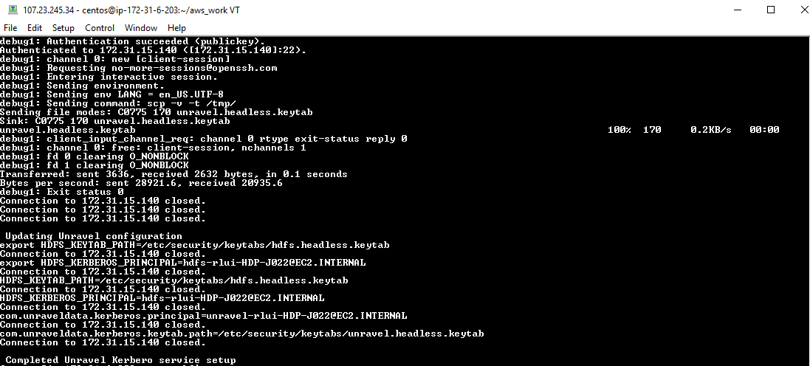

## Kerberoized HDP setup

### What is this CF template about
This is a CF template to create kerberoized HDP cluster.

HDP-custom-k9.json file is for existing KDC and doesn't include a kerberos server; and requires manual KDC setup in Ambari UI.

HDP-custom-k10.json file will do the followings:

-    create Kerberoized HDP + Kerberos server
-    setup Kerberos on Amabari automatically with admin principal ``admin/admin@EC2.INTERNAL``, secret is ``adbc123``
-    setup unravel headless principal and copy the keytab file to the /etc/security/keytabs on Gateway node.
-    Setup unravel properties for kerberos on Gateway node

### How to use this template

download the template, parameter, tags, and bash script file into the /tmp folder of your configured AWS workstation

-    HDP-custom-k10.json
-    parameter-10.json
-    tags.json
-    hdp-aws-master-TK11.sh

Change the above ``tags.json`` and ``parameter-10.json`` files to reflect your own AWs environment.

    chmod a+x  hdp-aws-master-TK11.sh

Run the bash script to create the Kerberized HDP cluster

     ./hdp-aws-master-TK11.sh  <cluster-name>

On completion, you should have 7 AWS instances running 

On the AWS workstation, on completion of the entire process takes about 50-65+ minutes
you should see the last line  ``Completed Unravel Kerbero service setup``

On the unravel Gateway node, the status of unRaveldata software is stopped; and you can start it with 

    sudo /etc/init.d/unravel_all.sh restart